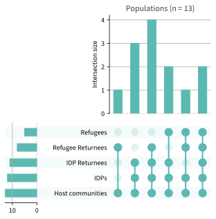
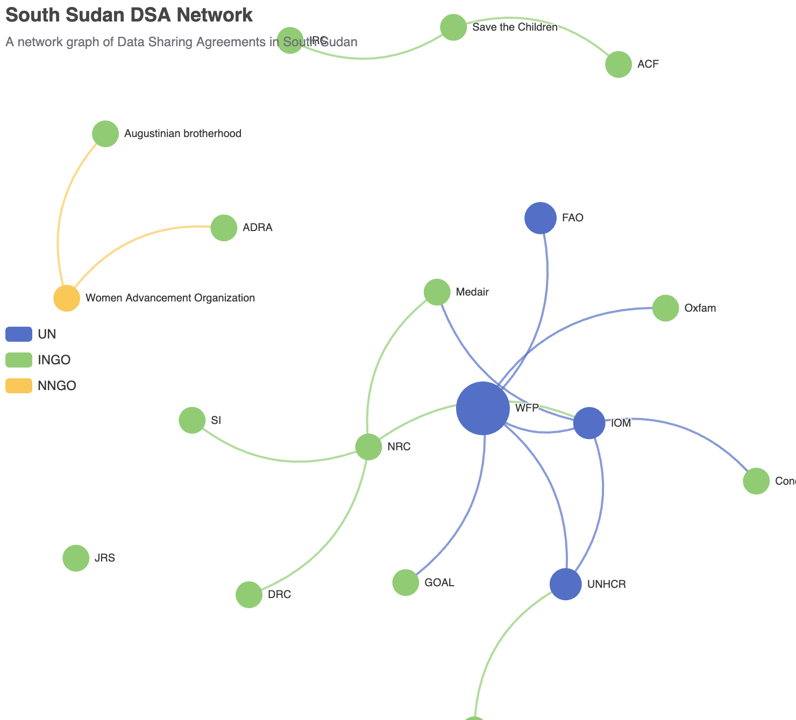

<!-- ::: {.callout-caution}
Note that this research is a working draft.
::: -->

# Introduction

This goal of this analysis is to understand registration and beneficiary analysis in South Sudan, specifically: [^1]

- what data do organizations collect during registrations and to what degree of commonality exist among the data points collected?

- what are the practices, processes and tools that organizations use and to how are they similar or differ?

- what organizations have Data Sharing Agreements with each other and what does it look like as a network?

Information from this analysis[^2] came from a survey to South Sudan organizations, individual and group interviews and observations, in Juba and Malakal in June and September 2025. 

## Acknowledgements

This analysis was co-funded by the European Commission's Humanitarian Office (ECHO).

{width="250px"}

# Survey Analysis

The survey was conducted between 27th June and 14th October 2025 and contains responses from 16 organization.[^3]

## Profile of respondents

Responses were received from international NGO’s nation NGO’s and UN entities.

The respondents represent organizations responding across 11 sectors, with Food Security and Cash Based Interventions most prominently. 11 of the 16 respondents work in CBI.

There was significant diversity in the organization as only two worked in the same combination of sectors.

All bar one organization work with both host communities and IDPs.

## Registration 

Only two respondents do not conduct registration activities.

Accountability as per the organizations procedures was the most cited purpose for registration, The purposes were also significantly varied - only 5 respondents shared the same set of purposes.

### Purpose and basis
Accountability as per internal organizational procedures was the most cited purpose, appearing in all but one response. 

Of the organizations that conduct registration, only 29% (4) consider their registration efforts as inter-agency.

{width="400px"}

The majority (70%) cited both informed consent and organizational manadate as the basis for registration activities.

Similar to the responses on "purpose", the primary policy for personbal information collection cited by 85% of respondents was their organizational data protection or data governance policy.

### Deduplication

The methods use to deduplicate[^4] show extreme variance across all respondents, with only two responding organizations using the same set of deduplication methods. Tokens were the most prominent method used for deduplication, used by all except two respondents.

For deduplication across organizations over a third of respondents referred to performing deduplication against WFP's SCOPE system, the largest resistration system in SOuth Sudan.

### Methods

38% of respondents only register head of household with information on household composition, along with registering alternative recipients from the same household.

Paper tokens are the primary means on confirmation, used by 62% of respondents.

Complaint and feedback mechanisms seen a wide variety of selections, with no two respondents using the same combination of methods.

### Authentication

While 85% of organizations authenticate before assistance, there is a large variance in the methods used for authentication, with producing a token the most cited of these.

### Data sharing

46% of respondents make their data accessible to other agencies, subject to the signing of a data sharing agreement.

However only 46% of organizations share data with others and only 38% having formalized data sharing agreements.

{width="400px"}

## Non registrations actors

Of the two respondent that do not conduct registration activities, both have activities that include direct assistance, with only sourcing their lists from community leaders and the other from both leader and from camp management personnel.

{width="400px"}

## Systems information

73% of respondents manage their data inside a database system.

{width="400"}

Commcare appeared as the most common system, however the question allowed the selection of only 1 system per response, some systems that are used by a number of organization but not not nescessairly as the organizations primary tool were not caputed.

Only 23% of respondents consider their system to be interoperable with other systems.

{width="400px"}

# Data Sharing Graph

Examining the surveyed organization, we can visualize which organizations have data sharing agreements with each other.

::: {.content-visible when-format="html"}
:::{.column-screen-right}
{width="100%" height="500px"}
:::
:::

::: {.content-visible unless-format="html"}

:::

Even among the small number of organizations surveys we can see significant fragmentation and loosely connected data sharing networks.

# Comparing Data Points

The following plot visualizes each data point collected by each organization. The histogram on the left show the count of datapoints among organizations - for instance, a 5 beside "Full name" means that 5 organizations gather that same data point. The top histogram show the number of organizations that collect the exact same data.

# Conclusion

Overall, registration and beneficiary management practices are significantly varied. Along with limited data-sharing agreements and a low degree of commonality of data fields across registrations forms, these factors limit the interoperability and use of beneficiary data across organizations and sectors in South Sudan. 

Interoperability of data and systems is a key requirement for cross-organizational and cross-sectoral efforts for targeting, deduplication and referral.

While signs of progress are evident from  previous in-country efforts , these impacts have mostly been limited to within small consortia of actors or UN agencies. To better address the challenge its should be viewed as an entire response-level challenge that requires as response-level approach to address.

# References

::: {#refs}
:::

<!-- Footnotes -->

[^1]: This analysis builds upon previous work done by the [Collaborative Cash Delivery Network (CCD)](https://datastew.org) and DIGID

[^2]: To identify patterns, this analysis makes use of [Upsetplots](https://arxiv.org/abs/2503.17517)
The selected dots represent selected values, the bars on the left represent the count of each value and the bars on top represent the count of intersecting/matching sets of values.

[^3]: Organizations who did not participate in the initial survey or share their registration forms are welcome to to add their responses [here](https://forms.office.com/e/WTqY4cDaKu) if interested. The survey analysis will be updated on request, to reflect additional responses. 

[^4]: Deduplication refers to its two main forms - deduplication of records of individuals or households in or across systems, and deduplication in reference to planned or received assistance.