<!-- ::: {.callout-note}
The workshop report is in draft stage and still subject to change.
::: -->

## Summary

Held on 19th November 2025, this workshop brought together national NGOs, international NGOs, UN agencies and cluster representatives to review the findings of a study on registration practices, discuss the main challenges, approaches and goals for interoperable registration data in South Sudan and to work on charting a way forward on the aspects of risk mitigation, standardization and governance 

The survey and group work provided the attendees the opportunity to build a shared understanding of the challenge in terms of current registration practices and the current state of data sharing agreements and registration/beneficiary data standardization.

By collectively examining the practices, organizations were able to reflect on their own registration practices, where they most aligned and diverged from the practices of others.

There was broad consensus on:

-  the importance of improving interoperability and the benefits that that would bring, to the individual organizations work, the collective work of the response and how aid is received and perceived by the affected communities.

- the need to tackle the issues at the whole of response level and the need for engagement at the highest levels of humanitarian decision making.

- the need for development of a single registration form should be conducted, with organizations doing registration to provide their forms to aid analysis and comparison of data points.

Recommendations from the workshop include:

- Continued gathering of registration forms to maintain a registrar to providing analysis of overlaps and informing the development of a Single Registration Form.

- Expand the data sharing agreement network graph as a means to understand current data sharing routes and monitor improvements.

- Engage high-level decision makers to ensure response-wide commitment to the interoperability agenda.

- Continue with a twin track approach of piloting/testing ideas and approaches within a small test group while simultaneously engaging at the entire response level on the work of SRF development and governance.

**Participants:** 40 participants from 20 organizations

## Introduction

### Background

The humanitarian community in South Sudan faces significant challenges related to beneficiary registration and data management. Current systems operate largely in silos, leading to inefficient referrals, duplicated beneficiary lists, inconsistent vulnerability criteria, and limited data sharing capabilities. These issues prevent effective coordination and increase the burden on crisis-affected populations who often must register multiple times with different organizations.

The Interoperable Data Ecosystem for Humanitarian Assistance (IDEHA) initiative seeks to address these challenges by promoting standardization, interoperability, and shared resources across humanitarian actors. Building on the mapping exercises and consultations conducted in the third quarter of 2025, this workshop aims to move from analysis to action initiating development of practical tools and frameworks for improved registration data interoperability.

### Workshop Objectives

The workshop aimed to:

1. Present findings from recent assessments of registration practices, data sharing patterns, and system capabilities among humanitarian actors in South Sudan
2. Build consensus around common registration standards and data sharing protocols
3. Begin co-design of practical tools including a Single Registration Form and a Data Protection Impact Assessment template
4. Explore the possible establishment of a Task Force on registration data interoperability
5. Demonstrate available technological solutions for beneficiary management and data sharing
6. Foster collaboration and commitment among humanitarian actors toward a federated approach to beneficiary data management

### Event Details

- **Date:** 19th November 2025
- **Time:** 09:00 – 15:00 CAT (6 hours)
- **Venue:** Imperial Plaza Hotel, Juba, South Sudan
- **Organizer:** IOM
- **Supported by:** European Civil Protection and Humanitarian Aid Operations (ECHO)

### Target Audience
Primary Participants (Approx 30 people):

- Technical registration and information management staff from UN agencies, INGOs, and NGOs implementing cash and voucher assistance or other humanitarian programs in South Sudan

- Program Managers for Cash programs.

- Cluster coordinators

- Data protection and legal officers from humanitarian organizations

## Workshop Overview

### Methodology

The workshop employed participatory and collaborative methodologies including:

- Presentation of evidence-based findings

- Small group working sessions with structured facilitation

- Plenary discussions and consensus-building

### Agenda Summary

| Time | Session |
|------|---------|
| 08:30 – 09:00 | Arrival, Registration and Networking |
| 09:00 – 09:30 | Opening |
| 09:30 – 11:00 | Session 1: Survey Findings |
| 11:00 – 11:30 | Coffee Break |
| 11:30 – 13:00 | Session 2: Interoperability |
| 13:00 – 14:00 | Lunch Break |
| 14:00 – 15:00 | Plenary Discussion, Next Steps & Closing|

### Participating Organizations

The following organizations attended the workshop:

ADA; Concern Worldwide; DRC; DCA; GOAL; IOM; IRC; Medair; MISSD; Mission Trust Aid; NCA; NRC; RRC; Save the Children International; UNOCHA; UNICEF; World Bank; WFP; WVI

Along with the FSL Cluster, CCCM Cluster, Cash Working Group and AAP Working Group.

## Session Summaries

### Opening Session

 *(09:00 – 09:30)*

#### Slides

<iframe src="slides1.html" width="100%" height="600px" style="border: 2px solid #ccc;"></iframe>

#### Welcome Remarks
The workshop was opened by Davis Carden, head of office for UNOCHA in South Sudan. 

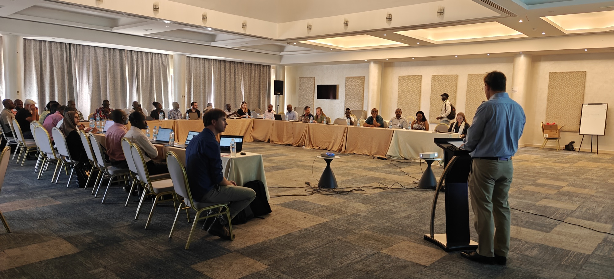

#### Introduction to Data Interoperability Challenge
Brian Mc Donald, Regional Registration Focal Point for IOM, presented the workshop agenda, its objectives and the "shared problems" that the body of work aims to address:

- Clear, timely referrals across organizations are rare or non-existent.

- Disjointed vulnerability criteria and targeting 

- Non-functioning, slow or impossible deduplication of lists.

- Data sharing that can’t keep pace with operational realities.

- Registration is siloed rather than a shared resource/responsibility

- Large variance in registration standards,  practices and system capabilities.

#### Background Recap

Amos Doornbos, Humanitarian Digital Adoption and Literacy Technical Director at World Vision International, provided background on the work of the Collaborative Cash Delivery (CCD) Network's work in South Sudan, which has been a key driver of interoperability efforts in South Sudan.

The presentation showed the Goverance stack from [DataStew.org](https://datastew.org/toolkit/overview/) which illustrates:

- The Data Layer defines what data is going to be collected, describes in what format it will be shared with others, and other data-related issues.

- The Legal Layer includes any legal arrangements and agreements that will be needed, such as multi-party Data Sharing Agreements.

- The Technical Layer includes the technology (software, and sometimes hardware) that will be needed to be developed or adopted by stakeholders.

- The Governance Layer describes the institutional arrangements that are needed to make responsible decisions about how the data will be used.

Also included in the presentation was the [HotPot](https://github.com/CCDNetwork/hotpot/) deduplication platform.

### Survey Findings

*(09:30 – 11:00)*
Session 1 opened with the findings from the survey conducted with registration partners conducted in Q3 2025 and finished with a group exercise to understand participants perspectives on the end goal, challenges and potential impacts of interoperable registration and beneficiary data.

#### Slides

<iframe src="slides2.html" width="100%" height="600px" style="border: 2px solid #ccc;"></iframe>

#### Presentation 1: Current Practices

**Registration Actors Survey Findings:**
The analysis (full version is available at [interoperabledata.xyz](https://interoperabledata.xyz/research.html)) showed the responses from the 15 organizations that completed the survey, a mix of international NGOs, national NGOs and UN agencies. Key findings of the analysis include:

- Overall, registration and beneficiary management practices in South Sudan are significantly varied. Along with limited data-sharing agreements and a low degree of commonality of data fields across registrations forms, these factors limit the interoperability and use of beneficiary data across organizations and sectors in South Sudan.

- Interoperability of data and systems is a key requirement for cross-organizational and cross-sectoral efforts for targeting, deduplication and referral.

- While signs of progress are evident from previous in-country efforts, these impacts have mostly been limited to within small consortia of actors or UN agencies. To better address the challenge it should be viewed as an entire response-level challenge that requires as response-level approach to address. 

#### Session 1 Breakout Groups

The session 1 exercise had the participants split into four groups each starting at a table with an associated question from below.Each group nominated a person to stay with the table, while after ten minutes, each group rotated to the next table to add to the work of the previous group.

At the end of the session, each table focal point presented the highlighted points for each question.

**Guiding Questions:**

1. What does an ideal humanitarian registration and beneficiary data ecosystem look like?

2. What are the biggest challenges organizations face when doing registration and managing data?

3. How would an ideal registration ecosystem impact your organization's work and the response as a whole?

4. From the perspective of the affected population, what would the ideal ecosystem look like?

**Group Outputs:**

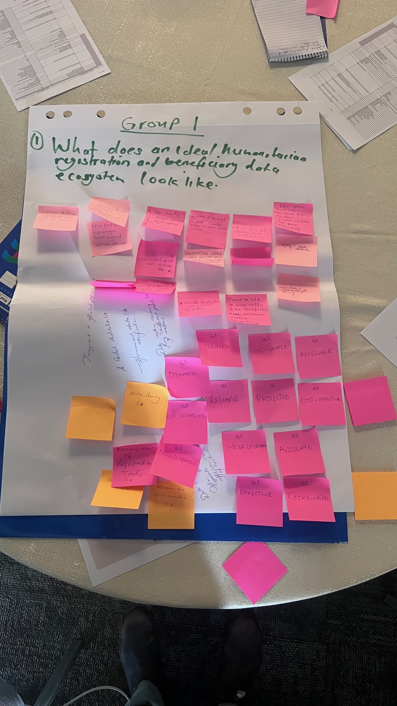

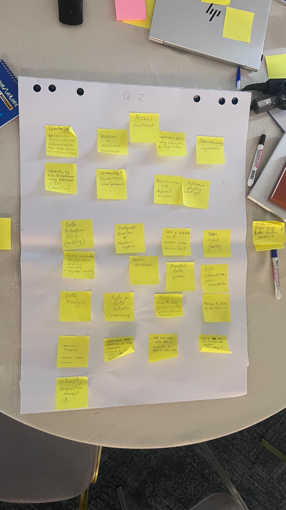

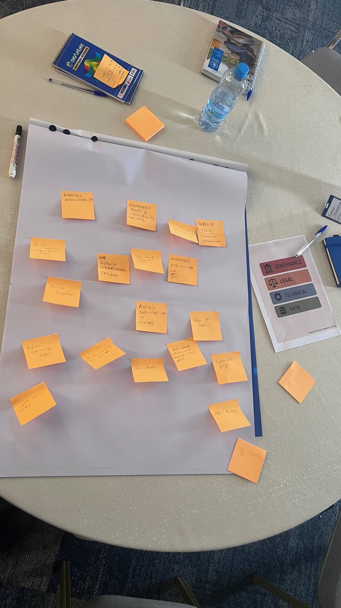

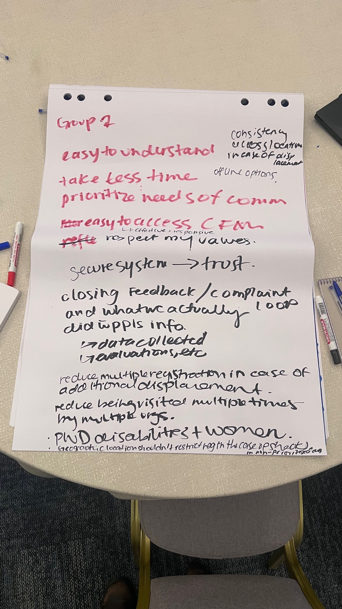

### Interoperability

*(11:30 – 13:00)*

Session 2 began with a presentation of a network graph depicting the data sharing agreements between the organizations that completed the survey. After this a a visualization was shown, comparing the data points containined within five registration forms shared with the survey team.

#### Presentation 2: Data Sharing and Interoperability

##### Slides

<iframe src="slides3.html" width="100%" height="600px" style="border: 2px solid #ccc;"></iframe>

The [Data Sharing Network Graph](https://interoperabledata.xyz/research.html#data-sharing-graph) depicting DSA sharing connections provided by the 15 responding organizations showed 4 unconnected groups of shared data, while the largest group, containing 12 organization was loosely connected, mostly held together by DSA's, with WFP and IOM.

::: {.content-visible when-format="html"}
:::{.column-screen-right}
{width="100%" height="500px"}
:::
:::

::: {.content-visible unless-format="html"}

:::

While the network graph is limited to the 15 organizations who completed the survey, it was noted that the tool will remain open for additional organizations to include their DSA connections to the graph.

The last part of the presentation presented a visualization of the [data points in registration forms](https://interoperabledata.xyz/research.html#comparing-data-points) provided by 6 of the survey respondents (3 of whom are from the Cash Consortium). This visual illustrated which fields are most common and least common among them and how many organizations using the same form/set of questions (3).

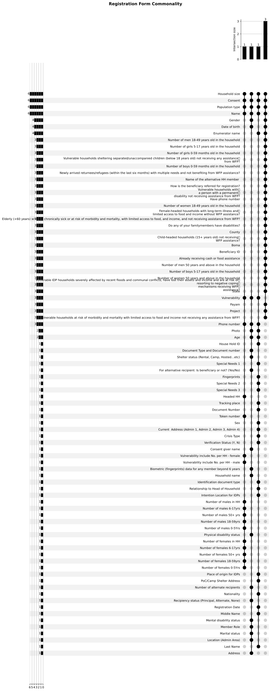

While finding from comparing 6 forms are limited, it was agreed that to move forward additional organizations will share their registration forms for inclusion, that it will become a registrar of forms and the visual will be updated to include the additional forms and will inform and support the work on developing a single registration form (SRF) for the response.

#### Breakout Group 2: Working Sessions

After the session 2 presentation, the room split into threee groups, each working on one of three tasks around Data Protection Impact Assessments; Standardizationa and Governance.

**Group A: Data Protection Impact Assessment**

The group was given the following task:

**Task:** List out the risks involved in registration and beneficiary management (both single and interagency) and their corresponding mitigation measures

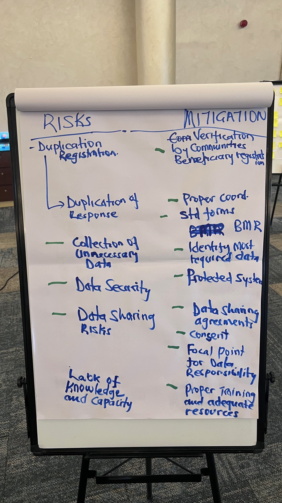

**Group B: Standardization**

**Task:** List out the key elements of a standardized registration form and methods . Plan the steps in implementing them.

**Considerations:**

- What is an appropriate question limit to balance information vs utility

- Should a forms fields be classified (core, recommended, optional etc)

- What methods should be standardized (biometric choices, all members of family etc.)

- How best to collectively revise/update the standards to meet the context

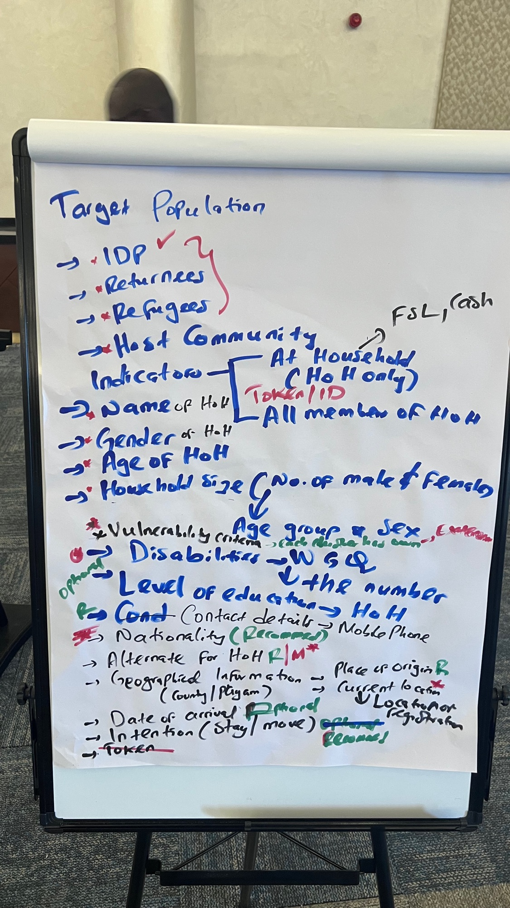

To enable easy standardization of registration form, the group started by identifying target population for humanitarian assistance (IDPs, Returnees, Refugees and Host Community). During the discussion, it emerged that some agencies only register head of household details and number of individuals in a household due to the nature of their program focusing on family size. Further discussion lead the group agreeing to capture detail for all household member. The group noted the need to have a lighter tool to uniquely identify target beneficiary enabling faster registration and efficient response during emergencies. Standardized consent clearly informing the beneficiaries of how the data will be protected, utilized and shared across partners of common interest was noted as the first key part for inclusion in SRF. 
 
In the end questions that emerged included
 
a) Who will have the final say on what goes on the SRF?
b) How often will the forms be reviewed?  
c) What minimal data protection principals will be applied? 
d) How to handle highly sensitive biometric data as use, restriction and capacity vary across agencies?

**Group C: Governance**

This group were given the following task:

**Task:** List out the purposes of data-sharing, the roles and responsibilities and the terms of use in an interoperable data ecosystem that supports timely and secure deduplication, shared targeting, referral 

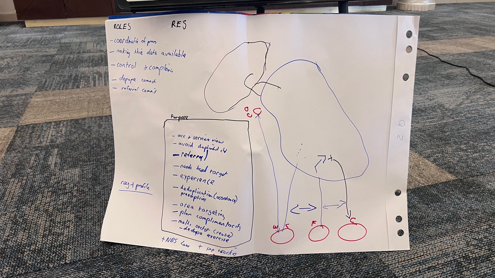

### Plenary Discussion

*(14:00 – 14:45)*

#### Recap of Group Work

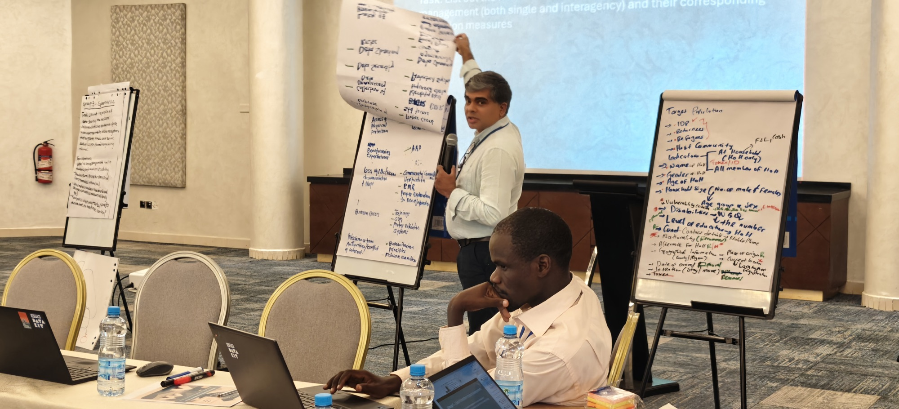{max-height="300px"}

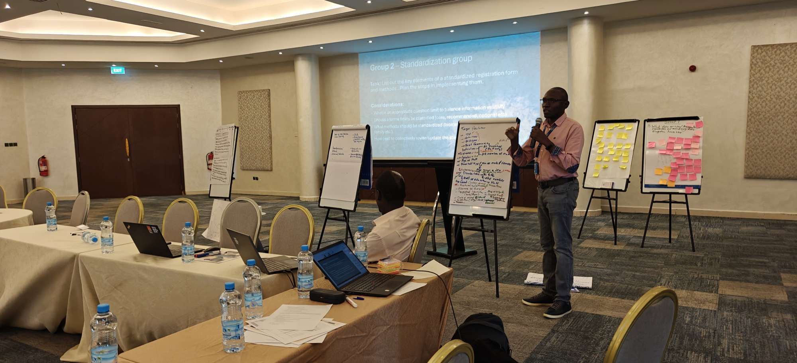

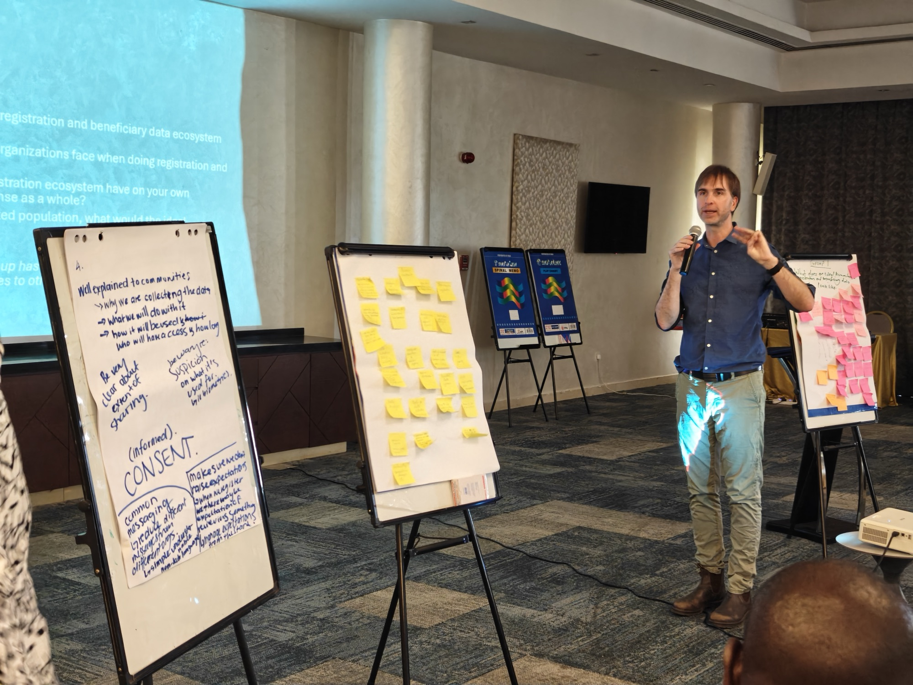

## Key Findings

### Shared Understanding Achieved
The survey and group work provided the attendees the opportunity to build a shared understanding of the challenge in terms of current registration practices and the current state of data sharing agreements and registration/beneficiary data standardization.

By collectively examining the practices, organizations were able to reflect on their own registration practices, where they most aligned and diverged from the practices of others.

There was broad consensus on the importance of improving interoperability and the benefits that that would bring, to the individual organizations work, the collective work of the response and how aid is received and perceived by the affected communities.

There was also broad consensus on the need to tackle the issues at the whole of response level and the need for engagement at the highest levels of humanitarian decision making.

### Progress on Single Registration Form Development

There was agreement that development of a single registration form should be conducted, with organizations doing registration to provide their forms to aid analysis and comparison of data points.

### DPIA Template Components Identified

The group identified the key risks and corresponding mitigations measures that require identification and addressing in the development of data protection impact assessment work.

### Task Force Decision/Roadmap

It was agreed that the coordination of technical work such as the development of a SRF will convene as part of the Information Management Working Group.

## Recommendations

- Continue gathering registration forms to maintain a registrar to providing analysis of overlaps and informing the development of a Single Registration Form.

- Expand the data sharing agreement network graph as a means to understand current data sharing routes and monitor improvements.

- Engage high-level decision makers to ensure response-wide commitment to the interoperability agenda.

- Continue with a twin track approach of piloting/testing ideas and approaches within a small test group while simultaneously engaging at the entire response level on the work of SRF development and governance.

## Contact

For questions or follow-up regarding this workshop, please contact:

- **Daniel HILLAIRE** - dhilaire@iom.int
- **Benson MBOGANI** - BMbogani@iom.int
- **Brian MC DONALD** - bmcdonald@iom.int

## Acknowledgements

The workshop was co-funded by the European Commission’s Civil Protection and Humanitarian Aid Operations (ECHO).

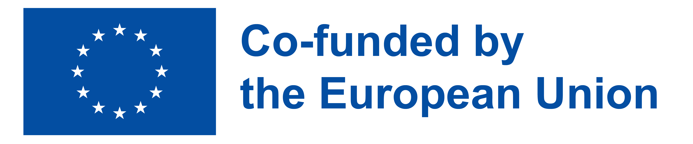{width="250px"}

IOM would like to thank the participants of the workshop for their support and engagement. 

## Annexes

<!-- ### Annex A: Participant List

| NAME                     | EMAIL                           | ORGANIZATION      |
|--------------------------|---------------------------------|-------------------|
| Grema Mustapha           | gmustapha@iom.int               | IOM               |
| Annie Ingram             | aingram@iom.int                 | IOM               |
| Mamlo Dennis             |                                 |                   |
| Gatbel Chot              | gchany@ss.goal.ie               | GOAL              |
| Silvester Nyang'an       | snyangan@ss.goal.ie             | GOAL              |
| Wusang Legge Wusang Wule | wusanglegge@ss.goal.ie          | GOAL              |
| Abubakar Tayib           | abubakartayib@drc.org           | DRC               |
| Khemis Stephen Pitia     |                                 | HI                |
| Reec Gabriel             | r.gabriel@forefrika.org         | NC                |
| Massad Ali               | massad.ali@wfp.org              | WFP               |
| Tombek                   | tef@dca.dk                      | DCA               |
| Duku Emmanuel            | duwa@dca.dk                     | DCA               |
| Joyce Francis            | ashafrancis@on.org              | OCHA              |
| Elijah Gatdong           | None                            | UNOCHA            |
| Mila Julius              | lokuta@unchcr.org               | UNHCR             |
| Yel Diit                 | dutghergel@jmjuba               | OCHA              |
| James Ruai               |                                 | UNICEF            |
| Deng Gatpan              |                                 | OCHA              |
| Mukulish Arafat          |                                 | World Bank        |
| John Garang              |                                 | CSD               |
| Mori Jane                | dssd@missiontrustaid.org        | MISSION TRUST AID |
| Rayan Yaghi              | rayan.yaghi@savethechildren.org | SCI               |
| Abraham Asefa            | abraham-asefa@savethechildren.org                  | FSLC              |
| Dan Langoya              | langoyadan@gmail.com            | ADA               |
| Pan Benard               | pan.Benard@malteser.org           | MISSD             |
| Majdi Abudurahaman       |                                 | NCA               |
| Arop Mathiang            | amiyockarop@gmail.com           | IOM/RRC           |
| Chido Musinga            | chidomusinga@medair.org          | MEB AIR           |
| Stephen Oguwa            | stephen.oguwa@nrc.no            | ERRM/NRC          |
| Daniel Musa              | Daniel.Musa@rescue.org          | IRC               |
| Sultan Mahmud            | sultan.mahmud@nrc.no             | NRC               |
| Kennedy Ayuku            | kennedy.stephen@nrc.no          | NRC               |
| Chika Oneli              | ochika@iom.int                  | IOM               |
| Cecilia Chazitana        | cchanzitana@iom.int            | IOM               |
| Brian Mc Donald          | bmcdonald@iom.int               | IOM               |
| Opoka Thomas             | topoka@iom.int                  | IOM               |
| Ropani Joice             | rjladu@iom.int                  | IOM               |
| Delil Manas              | mdelil@iom.int                  | IOM               |
| Benson Mbogani           | bmbogani@iom.int                | IOM               |
|                          |                                 |                   | -->

### Annex A: Workshop Agenda

The full agenda is available in the Workshop Overview section and in the workshop [invitation](https://interoperabledata.xyz/workshop.html#agenda)

### Annex B: Workshop Photos

::: {#fig-photos layout-ncol=4}

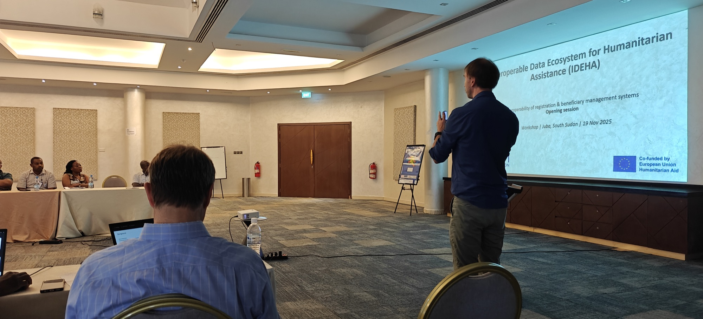

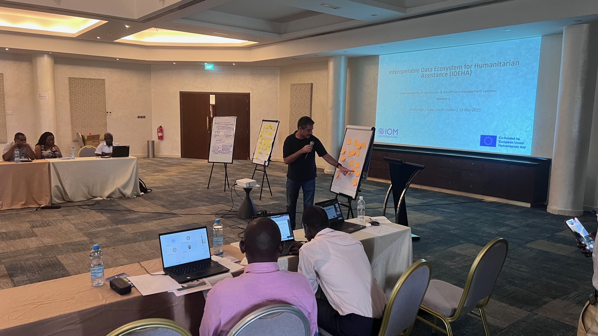

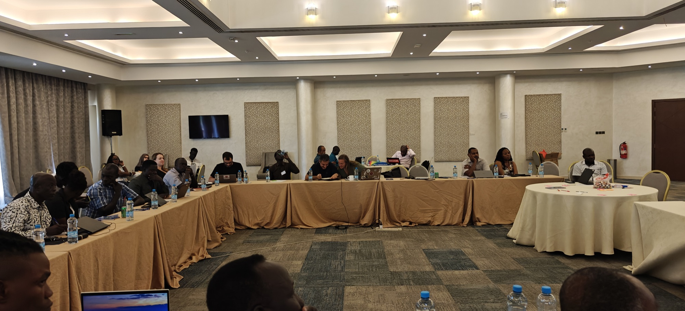

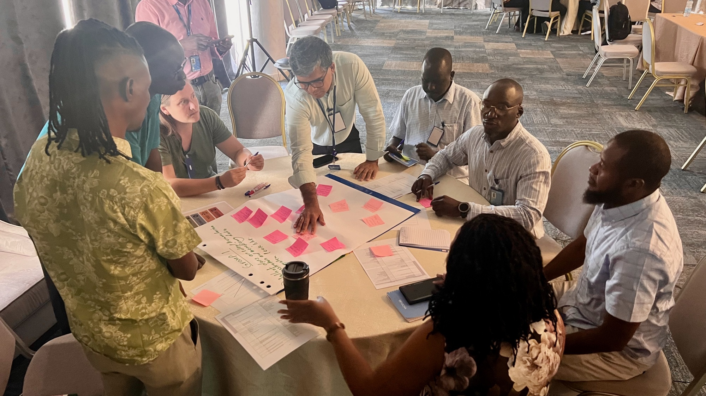

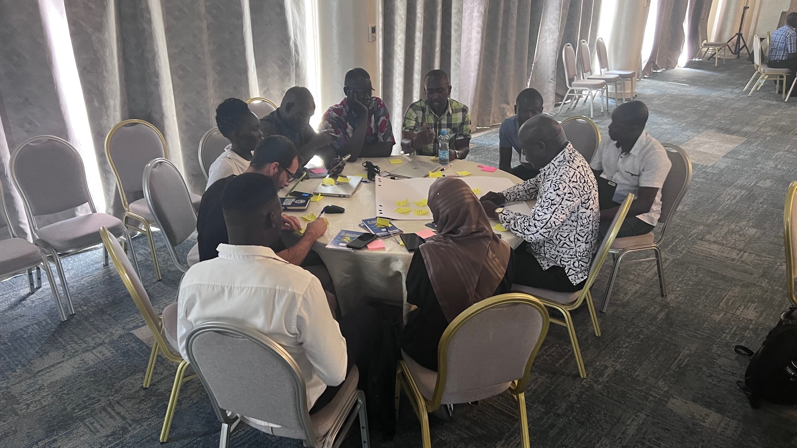

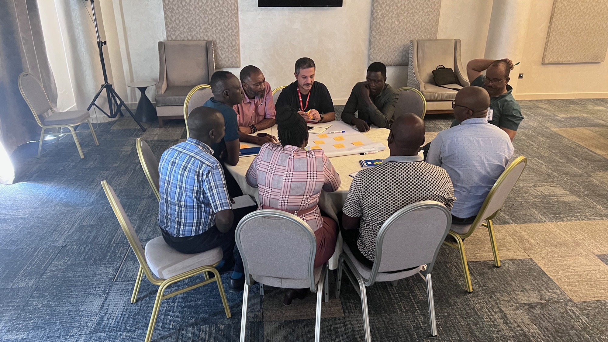

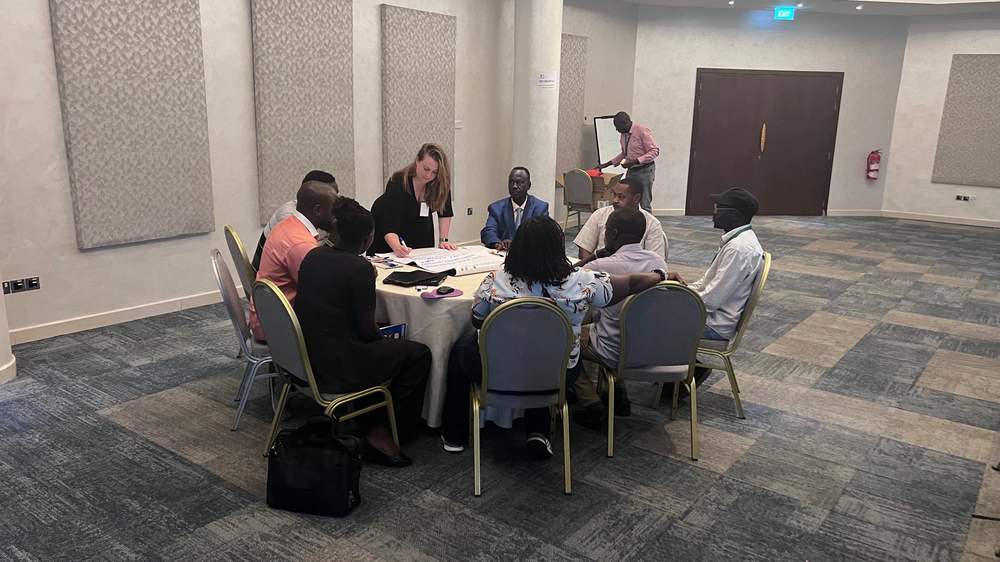

:::

### Annex C: Acronyms and Definitions

| Acronym | Full Form |
|---------|-----------|
| CAT | Central Africa Time |
| CCD | Collaborative Cash Delivery Network |
| CVA | Cash and Voucher Assistance |
| DPIA | Data Protection Impact Assessment |
| DTM | Displacement Tracking Matrix |
| ECHO | European Commission’s Civil Protection and Humanitarian Aid Operations department |
| IDEHA | Interoperable Data Ecosystem for Humanitarian Assistance |
| INGO | International Non-Governmental Organization |
| IOM | International Organization for Migration |
| NGO | Non-Governmental Organization |
| SCOPE | [Full form] |
| UN | United Nations |
| SRF | Single Registration Form |

**Report prepared by:** Brian Mc Donald (IOM)  | **Date:** 3 December 2025 | **Version:** 1