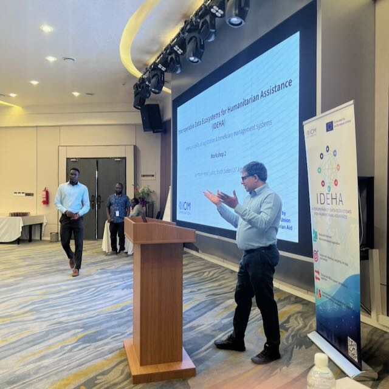
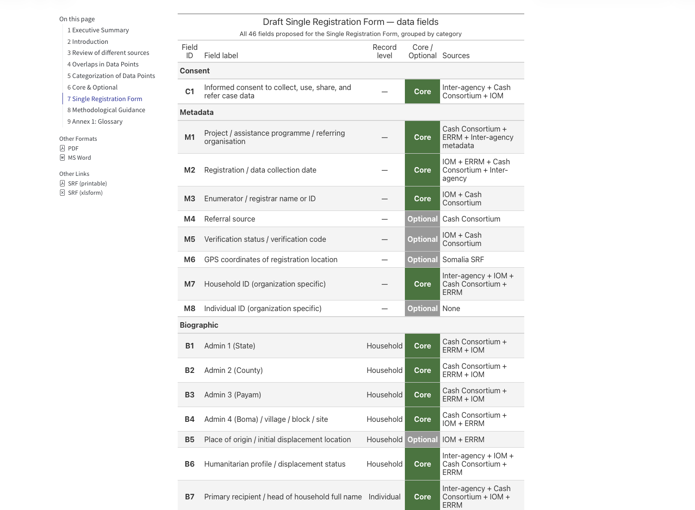
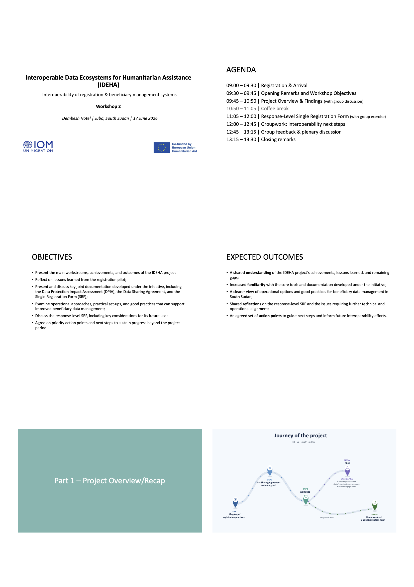
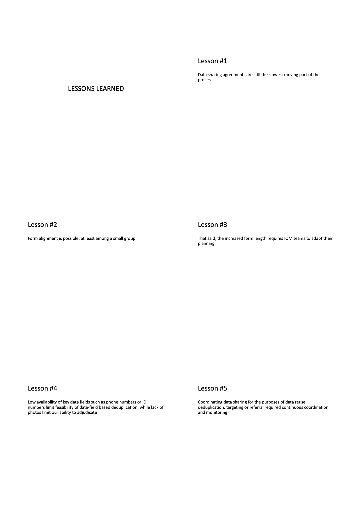
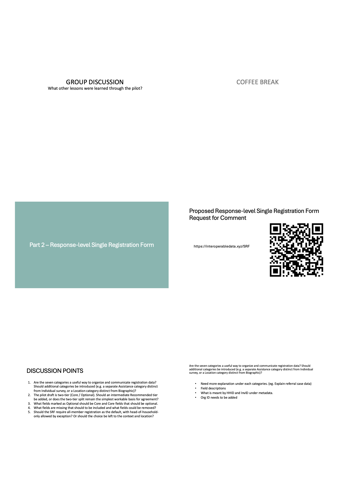
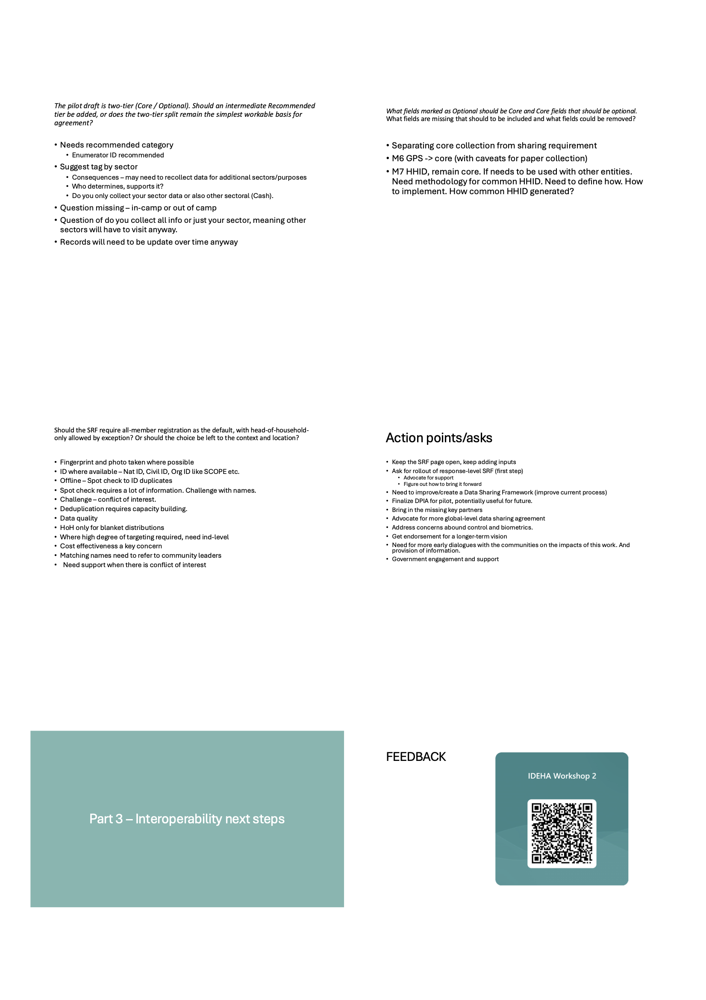

|                   |                                                |
|-------------------|------------------------------------------------|
| **Date**          | Wednesday, 17 June 2026                        |
| **Time**          | 09:00 – 14:00 CAT                              |
| **Venue**         | Dembesh Hotel, Juba, South Sudan               |
| **Organizer**     | International Organization for Migration (IOM) |
| **Co-funding**    | ECHO                                           |
| **Report author** | Brian Mc Donald, IDEHA Project Manager         |
| **Report status** | Draft - v1                                     |

------------------------------------------------------------------------

## Acronyms and Abbreviations {.unnumbered}

| Acronym | Meaning |
|------------------------------------|------------------------------------|
| CC | Cash Consortium |
| CWG | Cash Working Group |
| DPIA | Data Protection Impact Assessment |
| DSA | Data Sharing Agreement |
| DTM | Displacement Tracking Matrix |
| ECHO | European Civil Protection and Humanitarian Aid Operations |
| ERRM | Emergency Rapid Response Mechanism |
| HC/HCT | Humanitarian Coordinator / Humanitarian Country Team |
| AAP | Accountability to Affected Populations |
| HHID | Household Identifier |
| HoH | Head of Household |
| IDEHA | Interoperable Data Ecosystems for Humanitarian Assistance |
| IOM | International Organization for Migration |
| OCHA | United Nations Office for the Coordination of Humanitarian Affairs |
| SRF | Single Registration Form |

## Acknowledgements {.unnumbered}

IOM thanks the humanitarian partners, coordination structures, and donor representatives who participated in the workshop and contributed their operational experience and technical feedback. Particular thanks go to the partners of the registration pilot, including ERRM and Cash Consortium members, whose engagement throughout the IDEHA project made the results presented at this workshop possible. Thanks are also due to Kumudu Sanjeewa (UN OCHA) for delivering the opening remarks. The IDEHA project is co-funded by European Civil Protection and Humanitarian Aid Operations (ECHO) and IOM.

------------------------------------------------------------------------

## Introduction

### Background / Context

The humanitarian response in South Sudan continues to require greater efficiency, stronger coordination and more coherent approaches to beneficiary data management. Repeat registration of the same households by multiple organizations, limited deduplication and data-sharing processes, and varied data standards impose costs on both responders and affected people.

In this context, the IDEHA initiative - implemented by IOM and co-funded by ECHO - has supported efforts to improve interoperability, strengthen common standards, and promote responsible data-sharing practices among humanitarian partners. In South Sudan, the project advanced along with the following: a mapping of registration practices and a data-sharing framework, a registration pilot with ERRM and Cash Consortium partners and, at response level, the development of a Single Registration Form (SRF).

### Rationale

Workshop 1 in November 2025 established consensus among partners around the interoperability challenges and the path forward. With the project's end date of 30 June 2026 approaching, Workshop 2 was convened to move from consensus to consolidation: to review what the project delivered, validate lessons learned from the pilot, present the joint documentation developed under the initiative (DPIA, DSA, and SRF), and agree the action points partners will carry forward beyond the project period. The workshop also served as the platform to present the response-level SRF for review.

### Workshop Objectives

The workshop aimed to:

1.  Present the main work-streams, achievements, and outcomes of the IDEHA project in South Sudan;
2.  Reflect on lessons learned from the registration pilot implementation;
3.  Present and discuss key joint documentation developed under the initiative, including the DPIA, the Data Sharing Agreement, and the SRF;
4.  Examine operational approaches, practical set-ups, and good practices that can support improved beneficiary data management;
5.  Discuss the response-level SRF, including key considerations for its future use and alignment across partners;
6.  Agree on priority action points and next steps to sustain progress beyond the project period.

## Methodology

### Workshop Format

The workshop was a half-day, in-person event structured in three parts: (1) a project overview and lessons learned from the registration pilot; (2) a technical session on the response-level SRF; and (3) group work on interoperability next steps, concluding with plenary feedback and closing remarks.

### Facilitation Approach

Sessions combined short presentations with facilitated discussion. The SRF session was run as a structured consultation around five pre-framed discussion points, with the draft response-level SRF published in advance as a public Request for Comment at [interoperabledata.xyz/SRF](https://interoperabledata.xyz/SRF). The final session used small-group work to draft action points, which were consolidated in plenary.

### Data Collection / Reflection Methods

Partner inputs were captured in real time during group discussions and transcribed onto the workshop slides; the SRF Request for Comment page remains open for continued written input after the workshop. Attendance was recorded on a signed participant sheet(see Annex 2). 

## Participants

### Participant Profile

The workshop brought together operational and technical focal points engaged in beneficiary data collection, registration, data management, coordination, and protection-related work in South Sudan. Ninety-two individuals from more than 30 organizations were invited for the workshop; per the signed attendance sheet, 20 participants attended. The attendance list, is at Annex 2.

### Organizations Represented

Organizations present (signed attendance):

- **UN agencies and international organizations:** IOM, UN OCHA
- **International NGOs:** ACTED, Concern Worldwide, International Rescue Committee (IRC), Norwegian Refugee Council (NRC), Save the Children, DRC
- **National NGOs and other partners:** CSD, Nile Hope, AAP TWG 
- **Other:** Red Rose

Attendance thus included ERRM partners (NRC) and the Cash Consortium chair (Save the Children), alongside coordination (UN OCHA) and national partners. 

## Workshop Proceedings

### Opening and Project Overview (Part 1)

Following registration, opening remarks were delivered by Kumudu Sanjeewa (UN OCHA), introducing the workshop objectives and situating the event as the closing in-country milestone of the IDEHA project.

{width="400"}

The project overview retraced the journey of IDEHA in South Sudan along its two parallel tracks - the mapping of registration practices and the data-sharing framework - through the partner workshop, the registration pilot (which produced the pilot SRF, DPIA, and DSA), and the response-level SRF. The session presented five lessons learned from implementation (see @sec-lessons-learned) and closed with a group discussion inviting partners to add lessons from their own experience of the pilot.

### Response-Level Single Registration Form (Part 2){#sec-srf}

The second session presented the proposed response-level SRF, published as a Request for Comment at [interoperabledata.xyz/SRF](https://interoperabledata.xyz/SRF), and worked through the following five discussion points with partners:

1. Are the seven categories a useful way to organize and communicate registration data? Should additional categories be introduced (e.g. a separate Assistance category distinct from Individual survey, or a Location category distinct from Biographic)?
2. The pilot draft is two-tier (Core / Optional). Should an intermediate Recommended tier be added, or does the two-tier split remain the simplest workable basis for agreement?
3. Which fields marked as Optional should be Core and Core fields that should be optional.
4. Which fields are missing that should be included and what fields could be removed?
5. Should the SRF require all-member registration as the default, with head-of-household-only allowed by exception? Or should the choice be left to the context and location?

**Structure and categories.** This refers to the logical grouping of the different types of data fields collected or generated during registration and associated workflows

*Feedback:* The seven-category structure was broadly workable, but partners asked for fuller explanation under each category (e.g. referral case data), clearer field descriptions, and clarification of metadata fields such as HHID and InvID. 

**Tiering.** This is the proposed choice of classifying registration data fields as either *Core* or *Optional*.

Partners saw a potential need for intermediate *Recommended* tier alongside Core and Optional, or a possible sectoral tagging or similar that could be used to associate fields with defined use cases. The trade-offs were acknowledged: added complexity, sector-tagging raises the question of who determines and supports the tags, and whether an organization collects only its own sector's data - in which case other sectors must revisit the household anyway - or collects for all, with records in any case needing updating over time. 

**Core vs. Optional fields.** Partners proposed separating the obligation to *collect* a field from the requirement to *share* it. GPS location (M6) should move to Core, with caveats for paper-based collection. HHID (M7) should remain Core, but a common methodology for generating and implementing a shared HHID across organizations needs to be defined.

**Data fields.** Participants suggested adding of an additional Organization ID and the moving of GPS coordinates to be a core field.

**Registration level.** This refers to the discussion on the level in which registration is done, whether registration is enforced at the individual level for every household member, or whether collecting head-of-household details (with aggregate household attributes) is sufficient.

- *Option A* — Head of household only. Only the primary recipient (and optionally an alternate collector) is registered as an individual. Other household members are represented through aggregate fields: household size, sex-age cohort, disability screen.
- *Option B* — All household members. A full member roster is captured, with name, sex, date of birth and relationship for each person.

 On registration scope, head-of-household-only registration was considered adequate for blanket distributions, while individual-level registration is needed where a high degree of targeting is required; cost-effectiveness is a key concern in choosing between them.

### Group Discussion: Interoperability Next Steps (Part 3)

In the final session, participants worked in plenary to define the action points needed to sustain interoperability efforts beyond the project period. The consolidated action points are presented in @sec-action-points.

### Closing

The closing remarks reaffirmed partners' shared commitment to standardization, interoperability, and common frameworks for humanitarian assistance in South Sudan. On the response-level SRF, participants agreed to take the matter forward at the IDEHA Regional Workshop in Nairobi (24 June 2026) and to submit a request for endorsement to the HC/HCT. 

## Key Findings

### What Worked Well

- **Form alignment is achievable.** The pilot demonstrated that partners can align registration forms, at least within a small group, producing a jointly agreed SRF. This builds upon harmonization practices already undertaken by consortium members and experience with previous interoperability initiatives.
- **Joint documentation was delivered.** The pilot produced a working set of shared tools - the SRF, DPIA, and DSA - that partners can reuse and that provide a foundation for future interoperability efforts.
- **Open consultation generated substantive technical input.** The Request for Comment format for the response-level SRF drew detailed, actionable partner feedback on structure, tiering, and field definitions.

### What Did Not Work Well

- **Data sharing agreements remained the slowest-moving part of the process**, constraining the pace of every downstream activity that depended on them.
- **Low availability of key data fields in South Sudan context** - phone numbers, ID numbers - limited the feasibility of field-based deduplication, while the absence of photos limited the ability to adjudicate potential matches.

### Challenges

- The longer aligned form increases collection time, requiring implementing teams to adapt operational planning.
- Coordinating data sharing for reuse, deduplication, targeting, or referral required continuous coordination and monitoring rather than one-off meeting. 
- A common HHID across organizations has no agreed generation methodology yet, an issue linked to the limitations of reliance on data-field-based deduplication in a data-field-quality constrained environment.
- Key partners were not yet part of the pilot group, while there is consensus that high level engagement from a broad base is required to tackle the collective challenge.

### Good Practices

- Capture fingerprints and photos where possible, and record any available identifiers (national, civil, or organizational IDs such as SCOPE) to strengthen deduplication.
- Match the registration approach to the use case: head-of-household registration for blanket distributions; all-member/individual-level registration where precise targeting is required.
- Separate what must be *collected* from what must be *shared*, so data protection constraints do not block form alignment.
- Keep consultation channels open (the SRF Request for Comment page) so technical alignment continues beyond workshop settings.

### Thematic Findings - Response-Level SRF

The SRF consultation (@sec-srf) surfaced three structural decisions requiring follow-up: whether to introduce a *Recommended* tier and/or sector tags; how to define a common HHID methodology; and whether all-member registration should be the default with head-of-household-only by exception, or left to context. Partners also asked for richer documentation of categories and field definitions before wider rollout.

## Lessons Learned {#sec-lessons-learned}

Five lessons from the registration pilot were presented and validated with partners:

1.  **Data sharing agreements** are still the slowest-moving part of the process.
2.  **Form alignment** is possible, at least among a small group.
3.  The increased **form length** requires implementing teams to adapt their planning.
4.  Low availability of key data fields (phone numbers, ID numbers) in the context of South Sudan show the **limits of field-based deduplication**, while the lack of photos limits the ability to **adjudicate** matches.
5.  Coordinating data sharing for data reuse, deduplication, targeting, or referral requires **continuous coordination and monitoring.**

## Recommendations and Next Steps {#sec-action-points}

The following action points were agreed in group work and plenary.

### Immediate Actions

- Take the endorsement of the response-level SRF forward at the IDEHA Regional Workshop in Nairobi (24 June 2026) and submit a request for endorsement to the HC/HCT.
- Keep the SRF Request for Comment page open and continue collecting partner inputs.
- Request the rollout of the response-level SRF as a first step, and advocate for the support needed to take it forward.
- Finalise the DSA for the pilot, as a reusable reference for future initiatives.
- Bring in the key partners currently missing from the process.

### Medium-Term Actions

- Advocate for more global-level data sharing agreements to reduce repeated country-level negotiation.
- Secure endorsement of a longer-term vision for interoperability in South Sudan.
- Hold earlier dialogues with affected communities on the impacts and potential impacts of this work, and provide information to them.
- Explore government engagement and support.

### Roles, Responsibilities, and Timeline

Owners and target dates were not formally assigned to individual action points during the workshop. IOM stewards the SRF Request for Comment and DSA finalisation through project close (30 June 2026); partner-facing and endorsement actions rest with the coordination structures and the HC/HCT respectively. IOM's DTM team will continue following up on the action points beyond project closure.

### Roadmap / Action Plan

The agreed first step on the roadmap is the endorsement request for the response-level SRF, carried forward through the IDEHA Regional Workshop in Nairobi (24 June 2026) to the HC/HCT. The remaining action points in Sections 7.1 and 7.2 form the continuity agenda for partners and coordination structures beyond the project period.

## Conclusion

Workshop 2 closed the IDEHA project's in-country consultation cycle in South Sudan by consolidating what the project demonstrated: that form alignment among partners is achievable; that joint instruments - the SRF, DPIA, and DSA - can be produced and reused; and that the binding constraints on interoperability are less technical than institutional, above all the pace of data sharing agreements and the coordination effort that sustained data exchange requires. Partners agreed a concrete set of action points to carry this work beyond the project period, centred on rolling out the response-level SRF, strengthening the data sharing governance, widening the partnership, and engaging communities and government. The workshop reaffirmed a shared commitment to standardization, interoperability, and common frameworks for a more effective and coordinated humanitarian response in South Sudan.

------------------------------------------------------------------------

## Annexes {.unnumbered}

### Annex 1: Workshop Agenda {.unnumbered}

| Time | Session |
|------------------------------------|------------------------------------|
| 09:00 – 09:30 | Registration and arrival |
| 09:30 – 09:45 | Opening remarks and workshop objectives |
| 09:45 – 10:50 | Project overview and findings (with group discussion) |
| 10:50 – 11:05 | Coffee break |
| 11:05 – 12:00 | Response-level Single Registration Form (with group exercise) |
| 12:00 – 12:45 | Group work: interoperability next steps |
| 12:45 – 13:15 | Group feedback and plenary discussion |
| 13:15 – 13:30 | Closing remarks |
| 13:30 onwards | Lunch |



### Annex 2: Participant List {.unnumbered}

Transcribed from the signed attendance sheet.  Contact details are held on the original sheet and are omitted here.

**Table A - Attended (signed), 20 participants**

| \#  | Name                                | Organization             |
|-----|-------------------------------------|--------------------------|
| 1   | Kumudu Sanjeewa Warapitiya Acharige | UN OCHA                  |
| 2   | Hilaire Daniel                      | IOM                      |
| 3   | Jerry Delill Manas Gadi             | IOM                      |
| 4   | Ladu Ropani Joice Sebit             | IOM                      |
| 5   | Loku Opoka Thomas Okot              | IOM                      |
| 6   | Mbogani Benson                      | IOM                      |
| 7   | Mc Donald Brian                     | IOM                      |
| 8   | Nabre Loyce                         | IOM                      |
| 9   | Stephen Oguwa                       | NRC                      |
| 10  | Muhammad Usman Ayub                 | Concern Worldwide        |
| 11  | Khor Kueth                          | Concern Worldwide        |
| 12  | Victor Geri                         | Concern Worldwide        |
| 13  | Robert Dollar                       | ACTED                    |
| 14  | Allan Thamutho Stephen              | Nile Hope                |
| 15  | Thomas Benjamin                     | CSD                      |
| 16  | Pason Charles George                | IRC                      |
| 17  | Herbert Leni.                       | Red Rose                 |
| 18  | Hannah Bolder                       | AAP TWG                  |
| 19  | Abubakar Tayib Alkali               | DRC                      |
| 20  | Bernard Adero                      | IOM                      |



### Annex 3: Presentation slides {.unnumbered}

