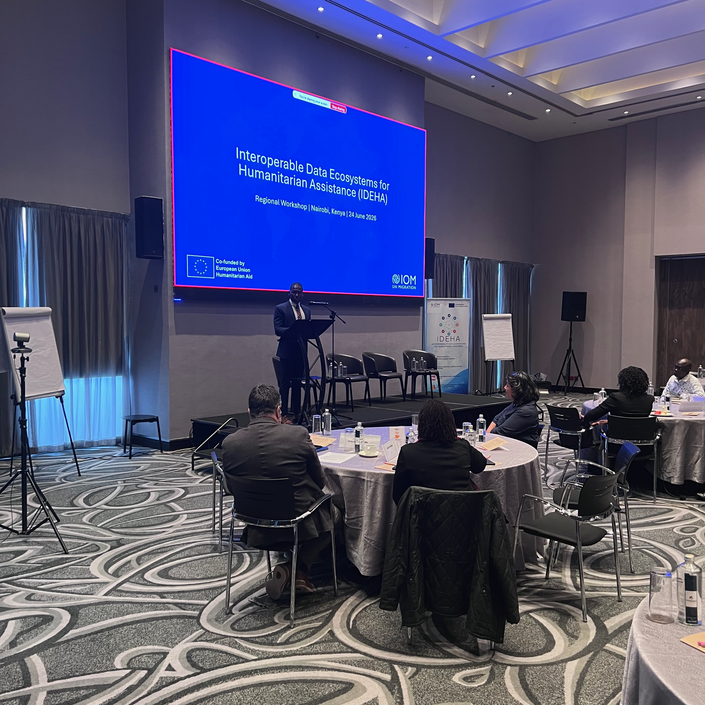
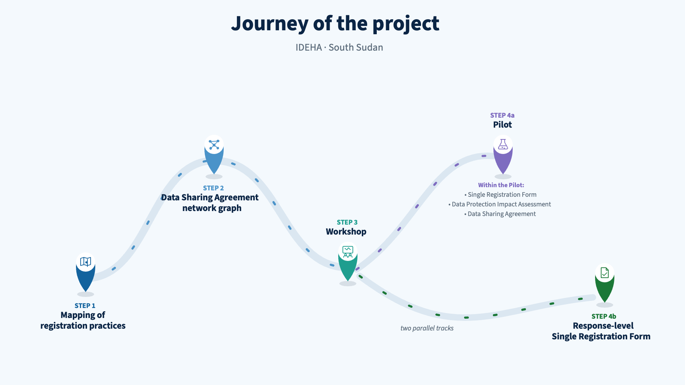
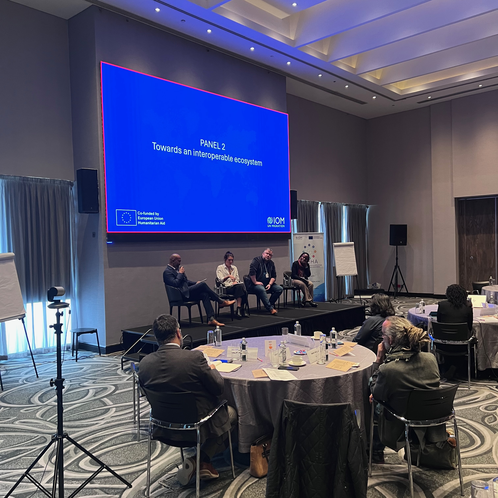
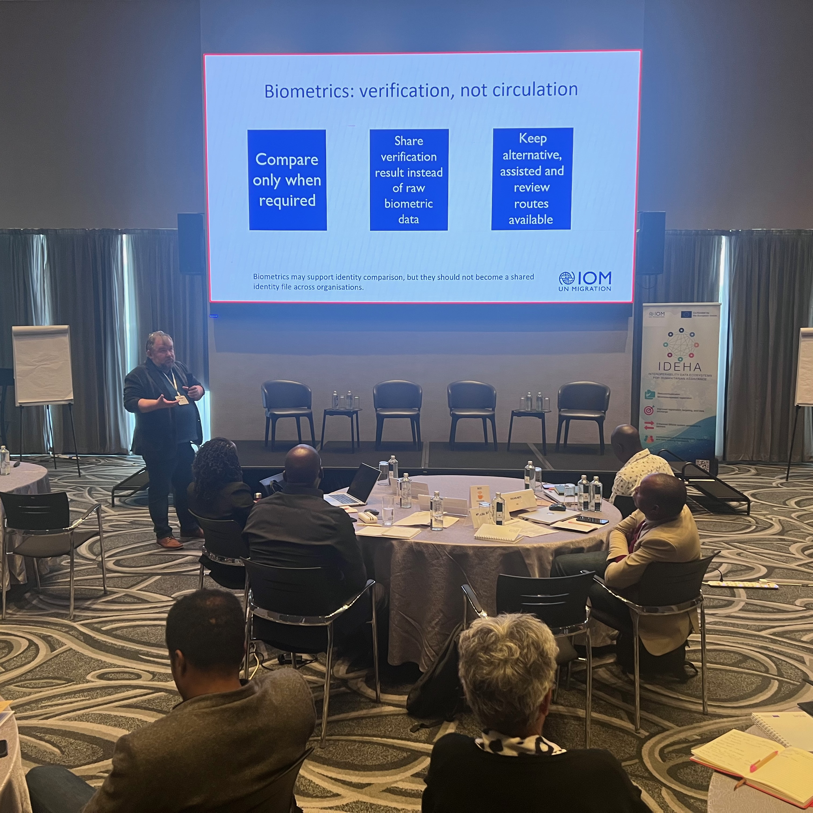
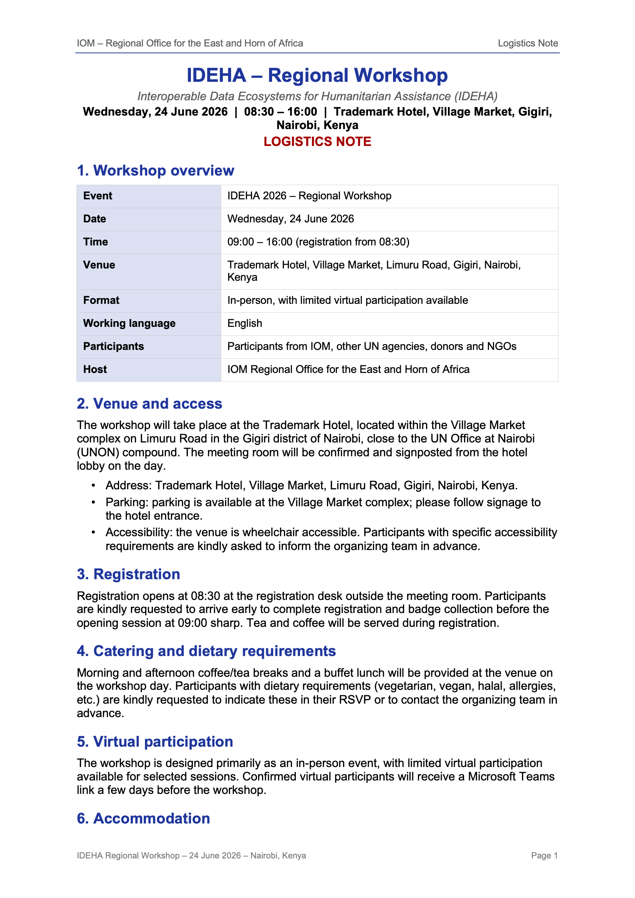
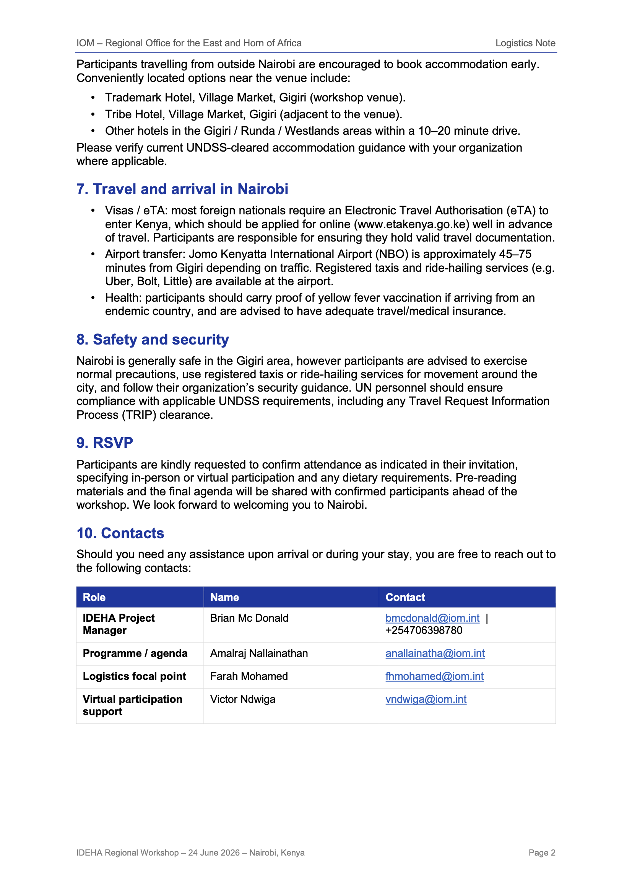
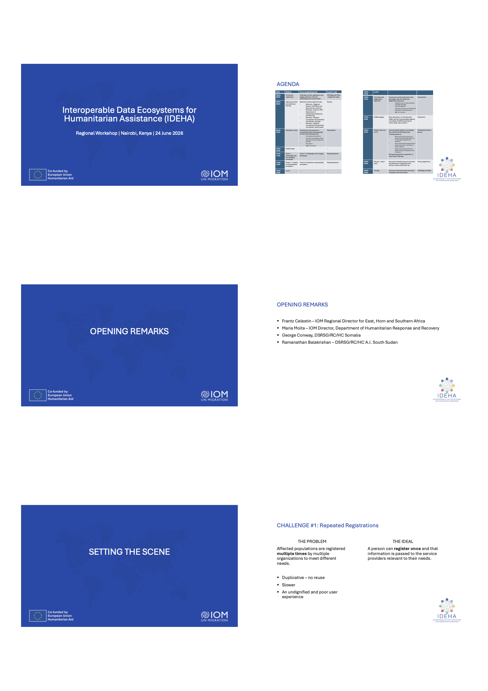

|                   |                                                         |
|-------------------|---------------------------------------------------------|
| **Date**          | Wednesday, 24 June 2026                                 |
| **Time**          | 08:30 – 16:00 EAT                                       |
| **Venue**         | Trademark Hotel, Village Market, Gigiri, Nairobi, Kenya |
| **Organizer**     | IOM Regional Office for the East and Horn of Africa     |
| **Format**        | In-person, with limited virtual participation           |
| **Co-funding**    | European Civil Protection and Humanitarian Aid Operations (ECHO)                  |
| **Report author** | Brian Mc Donald, IDEHA Project Manager                  |
| **Report status** | Draft - v1                                              |

------------------------------------------------------------------------

## Acronyms and Abbreviations {.unnumbered}

| Acronym | Meaning |
|------------------------------------|------------------------------------|
| CCD | Collaborative Cash Delivery network |
| DHRR | Department of Humanitarian Response and Recovery (IOM) |
| DPIA | Data Protection Impact Assessment |
| DSA | Data Sharing Agreement |
| DSRSG/RC/HC | Deputy Special Representative of the Secretary-General / Resident Coordinator / Humanitarian Coordinator |
| DTM | Displacement Tracking Matrix |
| ECHO | European Civil Protection and Humanitarian Aid Operations |
| ERRM | Emergency Rapid Response Mechanism |
| HCT | Humanitarian Country Team |
| IDEHA | Interoperable Data Ecosystems for Humanitarian Assistance |
| IOM | International Organization for Migration |
| NGO / INGO | Non-Governmental Organization / International NGO |
| OCHA | United Nations Office for the Coordination of Humanitarian Affairs |
| SCI | Save the Children International |
| SRF | Single Registration Form |
| UNHCR | United Nations High Commissioner for Refugees |
| WFP | World Food Programme |
| CC | Cash Consortium |
| ERRM | Emergency Rapid Response Mechanism |

## Acknowledgements {.unnumbered}

IOM thanks the humanitarian partners, donors, and private sector attendees who participated in the workshop and contributed their operational experience and technical feedback. Particular thanks go to the opening speakers — Frantz Celestin (IOM Regional Director), Bogdan Danila on behalf of Maria Moita (Director, DHRR), George Conway (DSRSG/RC/HC Somalia), and Ramanathan Balakrishnan (DSRSG/RC/HC a.i. South Sudan) — and to the panellists, facilitators, and presenters who shaped the day's discussions. The IDEHA project is co-funded by the European Civil Protection and Humanitarian Aid Operations (ECHO) and IOM.

------------------------------------------------------------------------

## Introduction

### Background / Context

Humanitarian responses across the East and Horn of Africa continue to be constrained by fragmented approaches to beneficiary data: affected populations registered repeatedly by different organizations, non-functioning or slow deduplication of beneficiary lists, data-sharing arrangements too slow to keep pace with operations, disjointed vulnerability and targeting criteria, siloed registration activities, weak referrals, and wide variance in registration standards and system capabilities.

In 2025 and 2026, the IDEHA project - implemented by IOM and co-funded by ECHO - has focuced on improving interoperability of registration and beneficiary management in South Sudan, building on much of the progress from other countries such as Somalia. The project conducted a mapping of registration practices, a registration pilot in South Sudan that producing a Single Registration Form (SRF), a Data Protection Impact Assessment (DPIA), and a Data Sharing Agreement (DSA), along with a proposed response-level Single Registration Form (SRF) and a Federated Trust Framework for the Federated Registion Approach.

### Rationale

With the project's end date of 30 June 2026 approaching, the Regional Workshop was convened as a forum to present the pilot findings, connect with lessons from other contexts in the region, review the Federated Registration Approach, connect IDEHA learning with UN80, and agree on priority next steps. It followed the country-level closeout workshop held in Juba on 17 June 2026, which had agreed to take review of the response-level SRF forward at the regional level.

### Workshop Objectives

The workshop aimed to:

1.  Understand the main results, challenges, and lessons from the South Sudan pilot, including implications for response-level registration and data exchange;
2.  Review the data governance outputs and identify how they can inform future programming, partner engagement, and technical implementation;
3.  Discuss the relationship between IDEHA, South Sudan SRF development, Somalia lessons learned, and broader regional interoperability needs;
4.  Inform UN80 and related discussions, especially around reducing duplication, strengthening data interoperability, and improving collective delivery;
5.  Agree on priority next steps, owners, and immediate follow-up actions for uptake, South Sudan continuity, and potential replication in other contexts.

## Methodology

### Workshop Format

The workshop was a full-day, in-person event with limited virtual participation, structured in four parts: (1) opening remarks and a scene-setting presentation; (2) two moderated panels on persistent challenges and on the requirements of an interoperable ecosystem; (3) a technical presentation of the Federated Registration Approach and a presentation on UN80 linkages; and parallel breakout groups on interoperability challenges and actions, concluding with plenary report-back and closing.

### Facilitation Approach

Sessions combined presentations with moderated panel discussion and small-group work. Parallel breakout groups worked through three guiding questions on continuity, replication, and linkages; inputs were captured on flip charts, transcribed, and reported back in plenary by group rapporteurs.

### Data Collection / Reflection Methods

Partner inputs were captured in real time during panels and breakout groups and consolidated into a structured mapping of challenges and actions (@sec-challenge-actions). Attendance was recorded by the organising team; the participant list is at Annex 2.

## Participants

### Participant Profile

The workshop brought together senior leadership, operational and technical focal points engaged in registration, targeting, cash programming, information management, data governance, and coordination across the region. Approximately 30 participants attended in person, with approximately 20 additional colleagues joining online.

### Organizations Represented

- **UN agencies and international organizations:** IOM, OCHA, UNHCR, WFP, UNICEF, and the Resident Coordinator's offices for Somalia and South Sudan
- **Donors:** ECHO
- **International NGOs and consortia:** ACTED, DRC, NRC, Save the Children (SCI), the Somalia Cash Consortium, the South Sudan Emergency Response Mechanism (ERRM), Food Security Cluster (Somalia)
- **Private sector / technology:** Red Rose

## Workshop Proceedings

### Opening Remarks and Framing

The workshop opened with remarks framing the day's purpose, expected outcomes, and the project context, delivered in a four-part arc — regional, global, Somalia contextand South Sudan context. Speakers positioned IDEHA within the wider push for efficiency and collective delivery under the UN80 and Humanitarian Reset and, emphasising that funding pressures make reducing duplication and strengthening interoperability an operational necessity rather than a technical aspiration.

**Frantz Celestin (IOM Regional Director, East Horn and Southern Africa)** welcomed participants and thanked ECHO for making IDEHA possible, framing fragmented, duplicative registration of displaced people across the region as both inefficient for agencies and undignified for affected families. He noted IOM's responsibility as one of many actors holding sensitive data, stressing that the future of humanitarian assistance - cash, anticipatory action and durable solutions — depends on connected, well-governed registration data, connected responsibly rather than centralized. He identified trust, common rules, and connection-by-default as the three conditions for successful interoperability, and asked participants to be honest about what is and isn't working, translate the South Sudan and Somalia lessons into concrete regional steps, and leave with the beginnings of a plan.

{width="400"}

**Bogdan Danila, on behalf of Maria Moita (Director, DHRR, IOM)** argued that with needs outpacing resources, the humanitarian system must fundamentally rethink how it works together, describing the human cost of repeated registration and data locked in siloed systems as a matter of dignity, accountability and protection, not merely a technical problem. Advocating for a federated approach in which organizations keep their own tools and data ownership while agreeing a common language and safe exchange mechanisms, rather than a single shared system or central database. Highlighting IDEHA's evidence from South Sudan and Somalia that the key challenges are governance, trust and data protection rather than technology, and called on participants to consolidate these lessons, make interoperability the norm rather than the exception, and scale the approach globally.

**George Conway (DSRSG/RC/HC, Somalia)**  explained that Somalia's interoperability work arose from operational necessity during the 2022 famine-prevention scale-up, after an Operational Peer Review and the Secretary-General's review of post-delivery aid diversion both found the response constrained by insufficiently connected systems. In response, the Humanitarian Country Team established a technical working group on data-sharing, put data-sharing agreements in place, and began developing a common registration approach with pre-enrolment de-duplication — measures which have reduced duplication, eased the burden on affected people and improved visibility of coverage. He stressed that the principal challenges have been governance, data protection and inter-agency trust rather than technology , that a people-centred approach mapping the household journey has been essential, and offered Somalia's experience as practical evidence rather than a finished model.

**Ramanathan Balakrishnan (DSRSG/RC/HC a.i., South Sudan)** thanked IOM's Regional Office and  ECHO, and described South Sudan as one of the most complex humanitarian operations globally - nearly 10 million people (over half the population) requiring assistance, more than 1.3 million returnees and refugees arriving from the war in Sudan, a sixth consecutive year of severe flooding, and continued regional alert for Ebola — with overlapping crises falling on communities with the least capacity to cope. He set out the practical consequences of fragmented registration — returnee and displaced families forced to register multiple times, and disconnected systems making it difficult to see who has received assistance, risking duplication in some areas while others remain underserved — and welcomed IDEHA as supporting reduced duplication, better data exchange and the humanitarian reset's recommendations for common interoperable systems amid declining funding. Drawing on Somalia's more advanced experience, he noted the main challenges are linked to trust, governance and data protection rather than technology alone, and committed that the close of IDEHA is not the end of the work for South Sudan: the Single Registration Form and interoperability agenda will be carried forward so the pilot's progress is sustained.

### Setting the Scene

Led by Brian Mc Donald and Amalraj Nallainathan, the scene-setting presentation beagn by introducing humanitarian registration and beneficiary data interoperability, structured around seven recurring challenges and the "ideal" each points:

1. **Repeated registrations** - people are registered multiple times by multiple organisations. *Ideal:* a person registers once and that information reaches the service providers relevant to their needs.
2. **Overlapping assistance** - deduplication is slow, impossible, or non-functioning. *Ideal:* an organisation can learn whether a person exists in another organisation's records and whether they have received assistance.
3. **Data sharing too slow to be useful.** *Ideal:* data moves from where it is held to where it is needed quickly enough to guide operational decisions.
4. **Vulnerability and targeting** - disjointed criteria create an "eligibility maze." *Ideal:* minimal data points that still feed a coherent understanding of vulnerability.
5. **Another siloed activity** - registration is treated as siloed rather than as a shared resource. *Ideal:* organisations can leverage registration done by others.
6. **Referrals** - clear, timely cross-organisation referrals are rare or non-existent.
7. **Varied practices, missing standards.** *Ideal:* shared standards that enable data exchange.

Following this it  moved to showing an overview of the project's activities in South Sudan, from the initial mapping of practices and data sharing, to the workshop that led to piloting and the development of a respnse-level SRF. 

{width="400"}

The presentation concluded with with an overview of some of the  best practices from Somalia and South Sudan, notably the Somalia HCT Common Policy on integrated, people-centred response (October 2025); Standard/Single Registration Forms in Somalia and South Sudan; a Federation of Registration Systems Framework; and a technology-agnostic technical architecture. 

In closing the Amalraj finished with a call to participants to learn from each other's actions in the two countries and to ask how the interoperability work can be scaled.

### Panel 1 - Challenges and the Changing Landscape

**Facilitator:** Manuel Pereira, IOM Chief of Mission, Somalia. 

**Panellists:** Stephen Oguwa (ERRM, South Sudan / NRC), Kumudu Sanjeewa (OCHA, South Sudan), Stephane Savarimuthu (UNHCR Regional Office, Nairobi).

The first panel examined the challenges that persist in registration, targeting, and data exchange across the region, and how funding pressures, the Humanitarian Reset, and UN80 are reshaping expectations on efficiency and collective delivery. Panellists reflected on what the South Sudan pilot and Somalia experience revealed about partner readiness and trust.

### Panel 2 - Towards an Interoperable Ecosystem

**Facilitator:** Mohan Mishra, (Regional Technical Specialist, IOM Regional Office). 

**Panellists:** Anna Martyres (Country Director, ACTED Somalia and Kenya), Ott Sarv (Digital Public Infrastructure Advisor), Judith Munyao (Regional Food Assistance & Cash focal point, ECHO Regional Office Nairobi).

The second panel turned to what a functioning interoperable registration ecosystem would look like in practice, and the governance, data protection, and accountability arrangements needed to underpin it. Discussion emphasised the incentives and support functions required for partners - particularly smaller and local NGOs - to participate, including donor support through funding, technical assistance, and modalities that promote alignment and responsible data sharing. 

{width="400"}

### The Federated Registration Approach

**Presenter:** Ott Sarv (Digital Public Infrastructure Advisor).

The afternoon presentation set out the governance and framework for data exchange under the Federated Registration Approach, covering data governance, data standards, and legal exchange recommendations - including agreement on a minimum shared attribute set to enable responsible comparison, deduplication, and referral, and a tiered governance framework operating at ecosystem, organisational, and operational levels - and a technology-agnostic technical architecture for federated registration and deduplication. The session reinforced that federation addresses the risks of centralisation - data sovereignty, single point of failure, and operational feasibility - while still delivering the deduplication and referral benefits operations require. The presentation was a preview of the Trust Framework, to be published as part of the project.

{width="400"}

### UN80 and the Humanitarian Reset

**Presenter:** Chandan Nayak, IOM.

This presentation after provided an overview of UN80 and its component workstreams, the Humanitarian Reset, and then provided linkages to the IDEHA interoperatbility around 5 questions:
1. Are disconnected systems still affordable?
2. Can we reduce duplication without one large centralized database?
3. Is interoperability mainly a technology challenge?
4. How can IDEHA inform UN80 IDM and CIO decisions?

### Breakout Groups and Plenary Report-Back

Three parallel facilitated breakout groups undertook interoperability ideation and linkages, guided by two questions: 

1. Identify the main interoperability challenges for your context and list the options address them.

2. To move forward on interoperability in your context, what actions are required, and who needs to be involved to achieve them.

Groups captured their thinking on flip charts, transcribed for plenary, and appointed rapporteurs to report back. The consolidated output is presented in @sec-challenge-actions.

### Closing

The closing session summarised the day's decisions and next steps, with thanks to participants, panellists, facilitators, and the ECHO co-funding that made the IDEHA project possible. 

## Key Findings

### Challenges and Corresponding Actions {#sec-challenge-actions}

Across the plenary presentations, panels, and breakout groups, participants identified eleven persistent challenges and matched them to concrete actions. This mapping constitutes the core substantive output of the day.

| # | Challenge | Corresponding action(s) |
|---|-----------|------------------------|
| 1 | Uneven biometric data collection in South Sudan, as some partners do not collect biometrics, limiting reliable deduplication. | Explore alternative unique identifiers, where biometric data is unavailable or cannot be shared. |
| 2 | Fragmented data and information-sharing practices, with partners using different formats, systems, and reporting structures. | Consider single or harmonised registration forms, drawing on lessons from Somalia  |
| 3 | Repeated registration, duplicated investments, and operational inefficiencies caused by parallel and fragmented systems. | Promote a federated approach, where agencies retain their own systems while agreeing on common standards, shared attributes, and protocols for limited data exchange. |
| 4 | Absence of consistently applied common standards, definitions, and minimum data requirements across agencies. | Agree on common data standards and a minimum shared attribute set to enable responsible comparison, deduplication, and referral across systems. |
| 5 | Unclear governance on which actor is authoritative for which type of data. | Establish a governance framework at ecosystem, organisational, and operational levels. |
| 6 | Bilateral data-sharing agreements that are useful but difficult to scale across the wider response, especially for smaller and local partners. | Encourage donor support through funding, technical assistance, and other modalities that promote alignment, interoperability, and responsible data sharing. |
| 7 | Risk of wrongful exclusion where automated matching or deduplication errors are not identified, reviewed, and corrected. | Ensure human-in-the loop adjudication processes and review/feedback mcechanisms |
| 8 | Lack of a common understanding of objectives, scope, and limitations at the onset of data-sharing or deduplication initiatives. | Ground implementation in contextual understanding - operational limitations, partner capacities, protection risks, and government dynamics. |
| 9 | Need to ensure data is used strictly for humanitarian purposes, with strong protection and accountability safeguards. | Ensure strong data data governance and data protection structures are in place.|
| 10 | Variable government buy-in and willingness, particularly where ownership, mandates, or data governance responsibilities are sensitive. | Engage the HCT and relevant coordination structures to support possible adoption of common frameworks in South Sudan. |
| 11 | Unclear roles and responsibilities relating to leadership, funding, system ownership, and operational accountability. | Strengthen coordination across agencies and include local partners, NGOs, government counterparts and, where appropriate, private sector actors. |

### Thematic Findings - UN80 and the Humanitarian Reset

The drive to reduce duplication, strengthen data interoperability, and improve collective delivery is closely connected to the objective of both UN80 and the humanitarian reset. Connecting learning for IDEHA and any subsequent field-focused interoperability effort, to these global initiative is vital to both inform and ground these efforts in operational realities.

## Lessons Learned

Drawing on the South Sudan pilot, the Somalia experience, and the day's discussions, the workshop distilled the following lessons:

1.  **The barriers are institutional more than technical.** Systems can talk to each other; the hard part is aligning legal frameworks, governance arrangements, and standards across organisations.
2.  **Data sharing agreements remain the slowest-moving part of the process**, and bilateral agreements do not scale to the wider response.
3.  **Federation answers the risks of centralisation** - data sovereignty, single point of failure, operational feasibility - while still delivering deduplication and referral benefits.
4.  **Deduplication depends on data availability.** Uneven biometric coverage and low availability of key identifiers require alternative unique identifiers and careful adjudication routes.
5.  **Trust must be maintained over time** through governance, monitoring, and accountability mechanisms, not established once at onboarding.

## Recommendations and Next Steps

### Immediate Actions

- Secure ownership and follow-up for the South Sudan SRF, so that momentum is not lost at project closeout (30 June 2026).
- Engage the HCT and relevant coordination structures in South Sudan on adoption of common frameworks, including a process for finalization and endorsement of the response-level SRF.
- Circulate the workshop summary note documenting key messages, decisions, and follow-up responsibilities to participants.
- Feed IDEHA learning into UN80 and Humanitarian Reset discussions.

### Medium-Term Actions

- Package Somalia and South Sudan lessons so other contexts can adapt the approach.
- Mobilise donor support through funding and technical assistance modalities that promote alignment, interoperability, and responsible data sharing - including for local partners who need additional capacity.

### Roles, Responsibilities, and Timeline

Owners and target dates were not formally assigned to individual actions during the workshop. In-country continuity actions rest with the IOM, OCHA and South Sudan HCT and coordination structures; the IOM Regional and HQ Offices carry forward regional and HQ-level follow-up and the connection to UN80 and the Humanitarian Reset; donor-facing actions rest with ECHO and other funding partners.

### Roadmap / Action Plan

The agreed sequence is: (1) secure SRF ownership and HCT engagement in South Sudan immediately after closeout; (2) operationalise the tiered governance framework with audit and consent mechanisms; and (3) package the learning for replication and feed it into UN80. The challenge-action mapping in @sec-challenge-actions provides the reference framework for tracking progress.

## Conclusion

The Regional Workshop closed the IDEHA project's consultation cycle by consolidating a clear message: the humanitarian system needs agreed standards, trusted governance, and controlled, purpose-limited data exchange that lets organisations keep their own systems while still comparing, deduplicating, and referring responsibly. Participants matched eleven persistent challenges to concrete actions, and agreed continuity priorities centred on sustaining the South Sudan SRF, operationalising governance, enabling replication, and connecting IDEHA learning to UN80. The workshop reaffirmed a shared commitment to standardization, interoperability, and common frameworks for more effective and coordinated humanitarian responses.

------------------------------------------------------------------------

## Annexes {.unnumbered}

### Annex 1: Workshop Agenda {.unnumbered}

| Time | Session | Format / Lead |
|------------------|------------------------------|------------------------|
| 08:30 – 09:00 | Arrival and registration | IOM Regional Office – registration desk |
| 09:00 – 09:40 | Opening remarks and workshop framing | Plenary — RD; Director DHRR; DSRSG/RC/HC Somalia; DSRSG/RC/HC a.i. South Sudan |
| 09:40 – 10:20 | Setting the scene | Presentation — Brian Mc Donald, Amalraj Nallainathan |
| 10:20 – 10:40 | Coffee break | — |
| 10:40 – 11:20 | Panel 1 — Challenges and the changing landscape | Moderated panel |
| 11:20 – 12:00 | Panel 2 — Towards an interoperable ecosystem | Moderated panel |
| 12:00 – 13:00 | Lunch | — |
| 13:00 – 13:40 | The Federated Registration Approach | Presentation — Ott Sarv |
| 13:40 – 14:00 | UN80 linkages | Discussion — facilitated by Chandan Nayak |
| 14:00 – 15:00 | Breakout groups 1 and 2 | Facilitated breakout groups |
| 15:00 – 15:30 | Plenary — report back | Group rapporteurs |
| 15:30 – 16:00 | Closing | IOM Regional Office |



### Annex 2: Participant List {.unnumbered}

Reproduced from the workshop participant list; titles shown where recorded. Additional invited participants attended online. The definitive attendance record is maintained by the IOM Regional Office organising team.

| # | Name | Organization | Role | In-person/Online |
|---|------|--------------|------|------------------|
| 1 | Abdul Guillaume | IOM | | In-person |
| 2 | Brian Mc Donald | IOM | | In-person |
| 3 | Victor Ndwiga | IOM | | In-person |
| 4 | Bernard Adero | IOM | | In-person |
| 5 | Irfan Hameed | IOM | | In-person |
| 6 | Paul Kinuthia | IOM | | In-person |
| 7 | Vijaya Souri | IOM | | In-person |
| 8 | Manuel Pereira | IOM | | In-person |
| 9 | Amalraj Nallainathan | IOM | | In-person |
| 10 | Chandan Nayak | IOM | | Online |
| 11 | Phyo Kyaw (SLSC) | IOM | | Online |
| 12 | Nelson Goncalves | IOM | | Online |
| 13 | Benson Mbogani | IOM | | In-person |
| 14 | Henry Kwenin | IOM | | In-person |
| 15 | Frantz Celestin | IOM | | In-person |
| 16 | Bogdan Danila | IOM | | Online |
| 17 | Mohan Mishra | IOM | | In-person |
| 18 | Ramanathan Balakrishnan | UN HC/RC South Sudan | | Online |
| 19 | Kumudu Sanjeewa | OCHA | IM, OCHA South Sudan | In-person |
| 20 | Mohammad Hamayoon Majidi | OCHA | Head of IMU | In-person |
| 21 | Julius Bett | DRC | Information Management Manager | In-person |
| 22 | Sara Echevarria | ACTED | Deputy Country Director | Online |
| 23 | Sarah Merieux | ACTED | CCCM PM | Online |
| 24 | Anna Martyres | ACTED | Country Director | In-person |
| 25 | Abdimajid Mohamed | ACTED | CCCM Specialist | In-person |
| 26 | Oscar Llorente Pelayo | Somalia Cash Consortium | Program Director | In-person |
| 27 | Faith Tindimwebwa | Somalia Cash Consortium | Consortium Director | Online |
| 28 | Judith Munyao | ECHO | | In-person |
| 29 | Quentin Le Gallo | ECHO | | In-person |
| 30 | Stephen Oguwa | NRC | ERRM | In-person |
| 31 | Stephane Naveen Savarimuthu | UNHCR | | In-person |
| 32 | Pia Jensen | NORCAP | | Online |
| 33 | Ott Sarv | IOM | | In-person |
| 34 | Esther Wanderi | NRC | Regional Compliance Officer | In-person |
| 36 | Christine Nkirote Gituma | UNHCR | | Online |
| 37 | Maarouf Issaka-Toure | UNHCR / WFP | Deputy Regional Rep | Online |
| 38 | Tasuku Matsumura | WFP | Programme Policy Officer, CBI | Online |
| 39 | Laksiri Nanayakkara | WFP | Head of VAM Unit | Online |
| 40 | Myriam Azar | IOM | | In-person |
| 41 | Oliver Westerman | OCHA | Global Cash | Online |
| 42 | Leni | Red Rose | | In-person |
| 43 | Danny Coyle | IOM | | Online |
| 44 | Candice | IOM | | Online |
| 45 | Alfred Duku| SCI | | Online |
| 46 | Maurizio Blasilli | WFP | | Online |
| 47 | Drabo | IOM | | Online |
| 48 | Martina Iannizzotto | Food Security Cluster, South Sudan | | In-person |



### Annex 3: Logistics Note {.unnumbered}

### Annex 4: Photos  {.unnumbered}

{width="400"}

{width="400"}

{width="400"}

### Annex 5: Slides  {.unnumbered}

